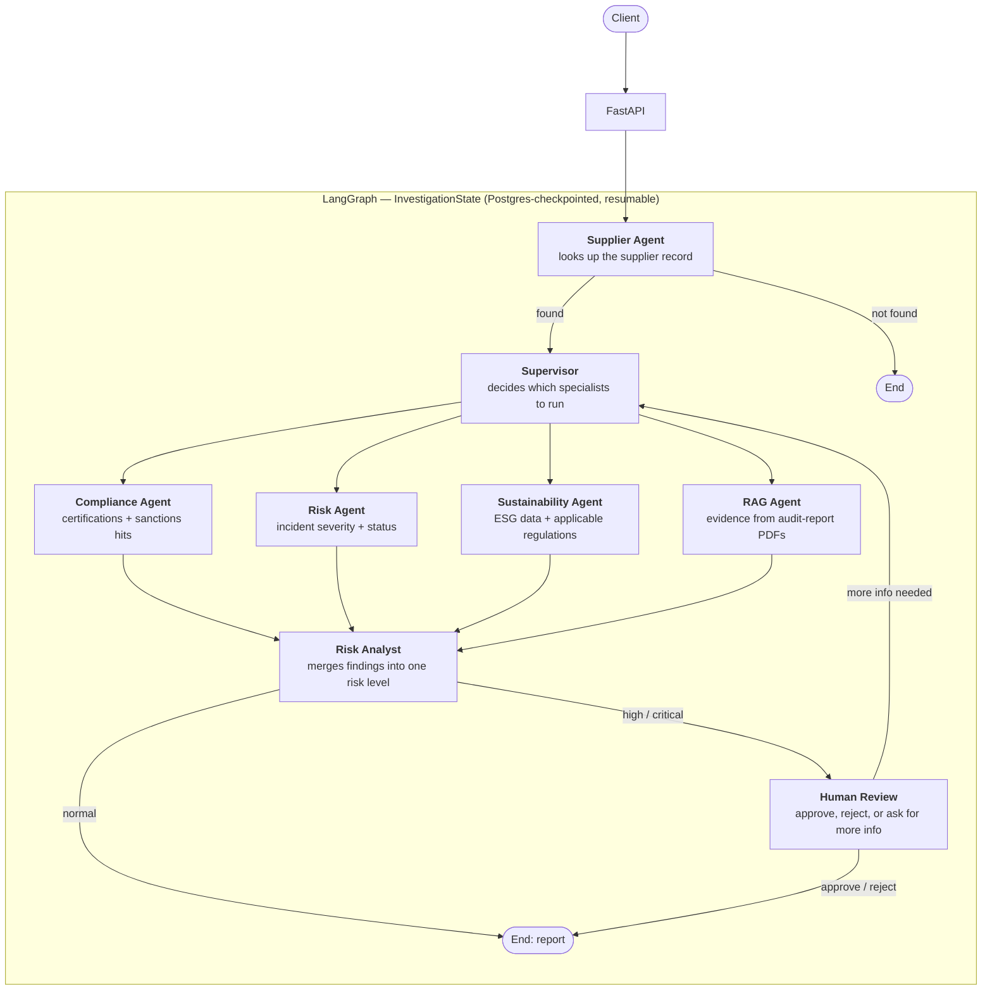
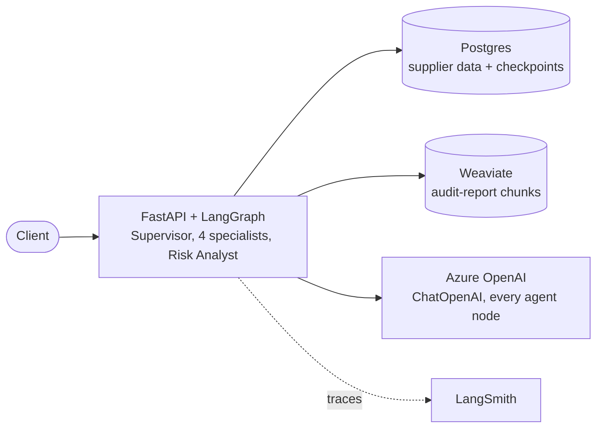
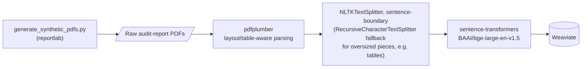

# SupplyGuard AI

A multi-agent supply chain risk investigation system built with LangGraph and FastAPI.

## Problem statement

Supplier due diligence today means manually cross-referencing certifications, incident reports,
sanctions lists, sustainability disclosures, and unstructured documents like audit reports that
live in disconnected systems — slow, inconsistent, and easy to get wrong. SupplyGuard AI
automates that investigation: given a supplier ID, specialist agents check compliance, risk,
sustainability, and document-research (RAG) signals in parallel, a risk analyst merges their
findings into one assessment, and high-risk cases are escalated to a human reviewer instead of
being auto-approved.

The full problem statement, the data model behind `data/`, and the exact task definition (input,
output, and what "done" means for the evaluation harness) are in
[docs/architecture.md](docs/architecture.md) — read that before touching `tools/` or `agents/`.

## Architecture

A supervisor agent routes an investigation across four specialist agents that run in parallel,
each backed by its own tools. A Risk Analyst merges their findings into one risk assessment, and
high-risk cases are routed to a human reviewer before a final report is produced.

### Investigation flow



### What each agent does

| Agent | Responsibility | Reads from |
|---|---|---|
| Supplier Agent | Resolves the supplier record from its ID | Postgres |
| Supervisor | Picks which specialists a case needs; re-plans if a reviewer asks for more information | — |
| Compliance Agent | Certification validity and sanctions-list hits | Postgres |
| Risk Agent | Incident history — severity weighed against resolved/open status | Postgres |
| Sustainability Agent | ESG/emissions data and which regulations apply | Postgres |
| RAG Agent | Searches on-site audit-report PDFs for supporting evidence | Weaviate (hybrid BM25 + vector search) |
| Risk Analyst | Merges every specialist's findings into one risk level + flags | — |
| Human Review | A person approves, rejects, or requests more information; pauses the graph until they do | Postgres (checkpoint) |

### System context



### RAG ingestion (offline, one-time)



`pydantic-settings` + `python-dotenv` load config from `.env`; `pytest`, `ruff`, and `mypy` are the test/lint/type-check toolchain and aren't pictured above.

See [docs/architecture.md](docs/architecture.md) for details and [docs/adr/](docs/adr/) for the
design decisions behind it.

## Project layout

- `src/supplyguard/agents/` — Supervisor, Supplier Agent, the four specialists, Risk Analyst,
  Human Review, and shared evidence-grounding logic
- `src/supplyguard/graph/` — LangGraph state, routing functions, workflow assembly, and the
  Postgres checkpointer
- `src/supplyguard/tools/` — one narrow, hard-coded query per tool (compliance, risk,
  sustainability, RAG, supplier), so every finding stays auditable
- `src/supplyguard/rag/` — PDF parsing, chunking, embeddings, and the Weaviate vector store for
  the RAG Agent's document ingestion/retrieval pipeline
- `src/supplyguard/api/` — FastAPI routes and request/response schemas
- `src/supplyguard/data/` — JSON-backed repository, Postgres ORM models + repository, and the
  seed script that loads one into the other
- `src/supplyguard/models/` — Pydantic domain models: supplier, compliance, risk, sustainability,
  findings, investigation
- `src/supplyguard/evaluation/` — evaluation dataset, evaluator, and metrics
- `data/` — sample/fixture data used by tools and evaluation, including `data/documents/` (the
  synthetic supplier audit report PDFs ingested by the RAG pipeline)
- `tests/` — unit, integration, and evaluation tests

## Getting started

```bash
cp .env.example .env
pip install -e ".[dev]"
docker compose up -d db weaviate
uvicorn supplyguard.main:app --reload
```

To use the RAG Agent, generate the synthetic audit report PDFs and ingest them into Weaviate
(one-off, only needed once per fresh `weaviate` volume):

```bash
python scripts/generate_synthetic_pdfs.py
python -m supplyguard.rag.ingest
```

## Status

Early scaffolding — folder structure in place, implementation in progress.
