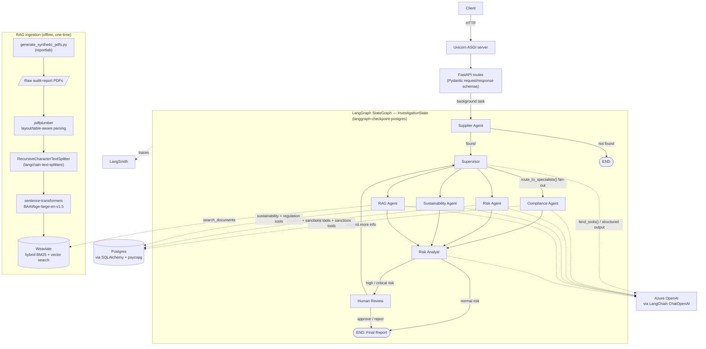

# SupplyGuard AI

A multi-agent supply chain risk investigation system built with LangGraph and FastAPI.
Backend-only project — no frontend is planned.

## Problem statement

Supplier due diligence today means manually cross-referencing certifications, incident reports,
sanctions lists, sustainability disclosures, and unstructured documents like audit reports that
live in disconnected systems — slow, inconsistent, and easy to get wrong. SupplyGuard AI
automates that investigation: given a supplier ID, specialist agents check compliance, risk,
sustainability, and document-research (RAG) signals in parallel, a risk analyst merges their
findings into one assessment, and high-risk cases are escalated to a human reviewer instead of
being auto-approved.

The full problem statement, the data model behind `data/`, and the exact task definition (input,
output, and what "done" means for the evaluation harness) are in
[docs/architecture.md](docs/architecture.md) — read that before touching `tools/` or `agents/`.

## Architecture

A supervisor agent routes an investigation across specialist agents (Compliance, Risk,
Sustainability, RAG) that run in parallel, each backed by its own tools. The RAG specialist
searches unstructured supplier documents (audit reports, disclosures) ingested as PDFs into
Weaviate, using sentence-transformers embeddings, rather than querying structured
Postgres/JSON records like the other three. Findings are merged by a Risk Analyst node into a
risk assessment. High-risk cases are routed to human review before a final report is produced.



Solid arrows are graph control flow; dashed arrows are data/model access. `pydantic-settings` + `python-dotenv` load config from `.env`; `pytest`, `ruff`, and `mypy` are the test/lint/type-check toolchain and aren't pictured above.

See [docs/architecture.md](docs/architecture.md) for details and [docs/adr/](docs/adr/) for the
design decisions behind it.

## Project layout

- `src/supplyguard/agents/` — supervisor, specialist agents, and the risk analyst
- `src/supplyguard/graph/` — LangGraph state, nodes, routing, and workflow assembly
- `src/supplyguard/tools/` — tool implementations used by agents
- `src/supplyguard/rag/` — PDF parsing, chunking, embeddings, and Weaviate vector store for
  the RAG Agent's document ingestion/retrieval pipeline
- `src/supplyguard/services/` — investigation orchestration, risk engine, report generation
- `src/supplyguard/api/` — FastAPI routes and request/response schemas
- `src/supplyguard/mcp/` — MCP server exposing SupplyGuard tools
- `src/supplyguard/evaluation/` — evaluation dataset, evaluator, and metrics
- `data/` — sample/fixture data used by tools and evaluation, including `data/documents/` (the
  synthetic supplier audit report PDFs ingested by the RAG pipeline)
- `tests/` — unit, integration, and evaluation tests

## Getting started

```bash
cp .env.example .env
pip install -e ".[dev]"
docker compose up -d db weaviate
uvicorn supplyguard.main:app --reload
```

To use the RAG Agent, generate the synthetic audit report PDFs and ingest them into Weaviate
(one-off, only needed once per fresh `weaviate` volume):

```bash
python scripts/generate_synthetic_pdfs.py
python -m supplyguard.rag.ingest
```

## Status

Early scaffolding — folder structure in place, implementation in progress.
